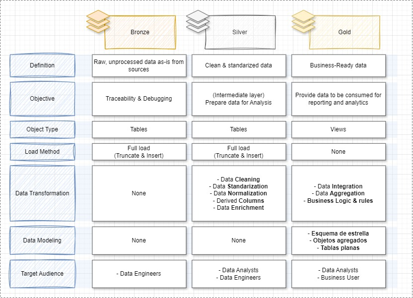

# Data Warehause

This project involves designing, building, and analyzing a Data Warehouse using the Pagila dataset — a sample PostgreSQL database, which models the operations of a DVD rental business.

The main goal is to transform transactional data from normalized relational tables into a centralized analytical environment optimized for decision-making.

---
## 🏗️ Data Architecture

The data architecture for this project follows Medallion Architecture **Bronze**, **Silver**, and **Gold** layers:


1. **Bronze Layer**: Stores raw data as-is from the source systems. Data is ingested from CSV Files into SQL Server Database.
2. **Silver Layer**: This layer includes data cleansing, standardization, and normalization processes to prepare data for analysis.
3. **Gold Layer**: Houses business-ready data modeled into a star schema required for reporting and analytics.

---
## 📖 Project Overview

This project involves:

1. **Data Architecture**: Designing a Modern Data Warehouse Using Medallion Architecture **Bronze**, **Silver**, and **Gold** layers.
2. **ETL Pipelines**: Extracting, transforming, and loading data from source systems into the warehouse.
3. **Data Modeling**: Developing fact and dimension tables optimized for analytical queries.
4. **Analytics & Reporting**: Creating SQL-based reports and dashboards for actionable insights.

## 🚀 Project Requirements

### Building the Data Warehouse (Data Engineering)

#### Objective
Develop a modern data warehouse using SQL Server to consolidate sales data, enabling analytical reporting and informed decision-making.

#### Specifications
- **Data Sources**: Import data from [https://www.kaggle.com/datasets/kapturovalexander/pagila-postgresql-sample-database?select=film.csv](https://www.kaggle.com/datasets/kapturovalexander/pagila-postgresql-sample-database?select=film.csv) provided as CSV files.
- **Data Quality**: Cleanse and resolve data quality issues prior to analysis.
- **Integration**: Combine both sources into a single, user-friendly data model designed for analytical queries.
- **Scope**: Focus on the latest dataset only; historization of data is not required.
- **Documentation**: Provide clear documentation of the data model to support both business stakeholders and analytics teams.

## ⚙️ Tools & Technologies

- SQL Server or PostgreSQL for DW implementation
- Python (with pandas) for ETL workflows

## 📂 Repository Structure
```
data-warehouse-project/
│
├── scripts/                            # SQL scripts for ETL and transformations
│   ├── bronze/                         # Scripts for extracting and loading raw data
│   ├── silver/                         # Scripts for cleaning and transforming data
│   ├── gold/                           # Scripts for creating analytical models
│
├── tests/                              # Test scripts and quality files
│
├── docs/                                                       # Project documentation and architecture details
│   ├── data_flow.jpg                                           # Draw.io file for the data flow diagram
│   ├── data_integration.jpg                                    # Draw.io file shows how the silver and bronze layer model relate and integrate in the gold layer
│   ├── data_layers.jpg                                         # Draw.io file shows, in general terms, the guidelines for the layers
│   ├── data_model.jpg                                          # Draw.io file for data models (snowflake schema)
│   ├── entity_relationship_model_bronze&silver_layer.jpg       # Draw.io file for entity relationship model for the bronze and silver layer
│   ├── high_level_architecture.jpg                             # Draw.io file shows the project's architecture
│   ├── data_catalog.md                                         # Catalog of datasets, including field descriptions and metadata
│   ├── naming-conventions.md                                   # Consistent naming guidelines for tables, columns, and files
│
│
├── README.md                           # Project overview and instructions
```
---
